.. _Product Search Page: http://stcadmin.stcstores.co.uk/inventory/product_search/
.. _Price Calculator: http://stcadmin.stcstores.co.uk/price_calculator/price_calculator/

*************
The Inventory
*************

.. contents:: Table of Contents

The inventory allows you to create, find and edit products within the Cloud
Commerce inventory. you can access it by opening http://stcadmin.stcstores.co.uk
and clicking on `Inventory <Product Search Page>`_.

.. _inventory-product_search:

The Product Search Page
=======================
To find an existing product navigate to the `Product Search Page`_. This
page allows you to search for products in two ways, **Basic Search** and
**Advanced Search**. Select the type of search using the radio buttons in the
**Search Type** field. You will notice that the search form changes when moving
between them.

.. image:: _images/inventory_help/product_search.jpg

.. _inventory-product_search-basic_search:

Basic Search
____________
The **Basic Search** is faster and easier to use than the :ref:`Advanced Search
<inventory-product_search-advanced_search>`. You should use the **Basic Search**
unless a feature of the **Advanced Search** is specifically required. To perform
a **Basic Search** click on the appropriate radio button in the **Search Type**
field (selected by default) and enter a search term in the search box. This will
return a list of all products for which the search text is present in any of the
following locations:

* :ref:`Range Title <glossary-product_range_details-title>`
* :ref:`Product SKU <glossary-product_details-sku>`
* :ref:`Supplier <glossary-product_details-supplier>`
* :ref:`Supplier SKU <glossary-product_details-supplier_sku>`
* :ref:`Brand <glossary-product_details-brand>`
* :ref:`Manufacturer <glossary-product_details-manufacturer>`
* Any :ref:`Variation Options <glossary-product_options-variation_options>`
* Any :ref:`Listing Options <glossary-product_options-listing_options>`

.. note::
    The search will match the SKU of a :ref:`Product <glossary-product>` but
    **not** the SKU of the :ref:`Product Range <glossary-product_range>`.

The time taken to complete a search depends on the number of results. if you are
more specific with your search text fewer products will match your search and
therefore the search will complete more quickly.

The **Hide End of Line** field is present in both the **Basic Search** and
**Advanced Search**. This adds or removes products from the search results based
on the :ref:`End of Line <inventory-range_page-end_of_line>` setting of the
**Product Range**. It has three options:

* **Exclude** (default): *Remove* **Ranges** marked **End of Line** from search
  results.
* **Include**: *Include* **Ranges** marked **End of Line** in the search results.
* **Exclusive**: *Only include* **Ranges** marked **End of Line** in the search
  results.

.. _inventory-product_search-advanced_search:

Advanced Search
_______________

The **Advanced Search** works in a similar way to the :ref:`Basic Search
<inventory-product_search-basic_search>` with some extra options.

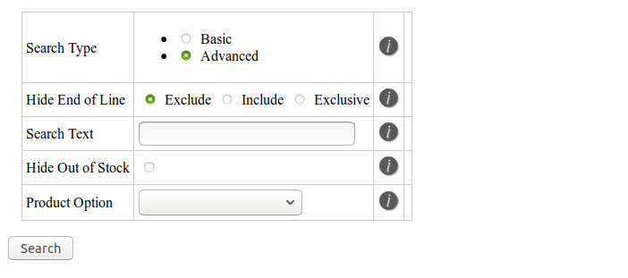

.. _inventory-product_search-hide_out_of_stock:

Hide Out of Stock
*****************
Remove out of stock products from the search result by checking the *Hide out
of stock* checkbox.

.. _inventory-product_search-product_options:

Product Option
**************
This field allows you to limit the search results to products which have a
:ref:`Product Option <glossary-product_options>` with a particular value. To do
this select a **Product Option** from the drop down box. This will cause a
second drop down box to appear with a list of all the existent values for the
selected **Option**. It can be useful to leave the **Search Text** field blank
and use the **Product Option** field to get a complete list of *all* the
products for which the **Product Option** matches a given value. For instance
you could select the **Supplier** **Product Option** and choose a supplier to
get a list of all products from that supplier.

.. _inventory-product_search-search-results:

Search Results
______________
After performing either a :ref:`Basic Search
<inventory-product_search-basic_search>` or an :ref:`Advanced Search
<inventory-product_search-advanced_search>` a table will appear containing every
:ref:`Range Page<inventory-range_page>` for which any :ref:`Product
<glossary-product>` matches the search criteria. The table includes the
**Range**'s SKU and title, some shortcuts to pages used to update the **Range**
and an option to show the **Range**'s Products.

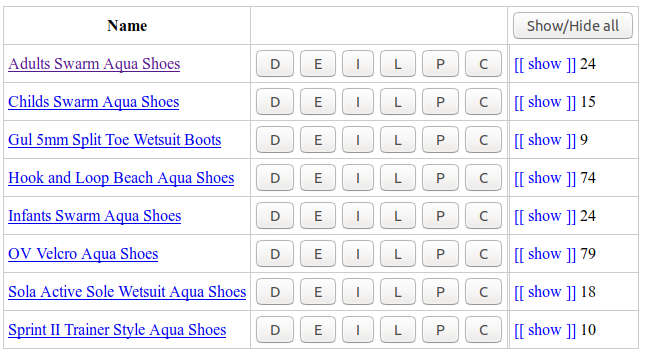

The title is a link to the :ref:`Range Page<inventory-range_page>` for this
:ref:`Product Range <glossary-product_range>`.

You can see the purpose of each shortcut by hovering over it's button. They are
as follows:

* **D** (**Descriptions**): The :ref:`Description Page<inventory-description_page>`.
* **E** (**Edit**): Open the **Range** in the **Product Editor**.
* **I** (**Images**): The :ref:`Images Page<inventory-images_page>`.
* **L** (**Locations**): The :ref:`Location Page<inventory-location_page>`.
* **P** (**Price Calculator**): The :ref:`Price Calculator<inventory-price_calculator>`.
* **C** (**Show on Cloud Commerce**): Opens the **Product Range** page on
  Cloud Commerce for this product.

To show the :ref:`Products <glossary-product>` for a :ref:`Product Range
<glossary-product_range>` click on the **[[show]]** button in the last column of
the table. This will show a table with a list of the **Range**'s **Products**.
This will include the **Product**'s SKU, full title and stock level. You can
update the stock level from here by changing the displayed stock level and
clicking on "Update Stock Level". You can hide the **Products** again by
clicking the **[[hide]]** button. You can show or hide the **Products** for
every **Range** by clicking on the **Show Hide all** button in the column
header.

.. image:: _images/inventory_help/product_search_results_expanded.jpg

.. _inventory-range_page:

The Range Page
==============
The Range Page shows details of a given :ref:`Product Range
<glossary-product_range>`. From here you can update any attribute of the
**Range** and view all of it's :ref:`Products <glossary-product>`.

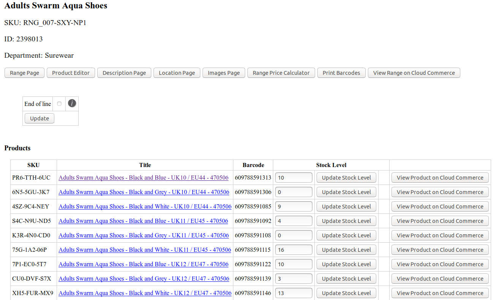

From here you can access  :ref:`Descriptions <inventory-description_page>`,
:ref:`Locations<inventory-location_page>`, :ref:`Image <inventory-images_page>`,
:ref:`Price Calculator <inventory-price_calculator>` and :ref:`Barcode Labels
<inventory-barcode_labels>` for the range as well as the :ref:`Product Page
<inventory-product_page>` for all of it's **Products**. You can click on the
title of a **Product** to go to it's **Product Page**.

It includes a table of **Products**, displaying the SKU and title for each as well
as allowing you to update the stock level by entering a new figure and clicking
"Update Stock Level".

.. _inventory-range_page-end_of_line:

End of Line
___________
From the **Range Page** you can mark a Range as :ref:`End of Line
<glossary-product_range_details-end_of_line>`.

.. _inventory-product_page:

The Product Page
================
The **Product Page** allows you to update attributes of a :ref:`Product
<glossary-product>`.

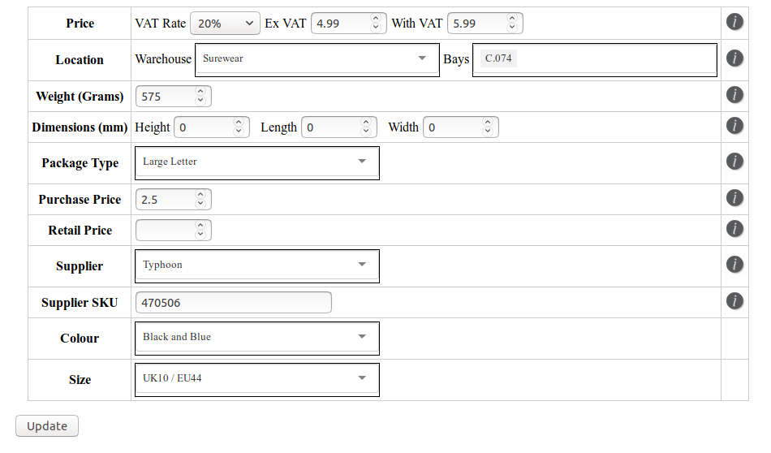

From here you can update:

* :ref:`VAT Rate <glossary-product_details-vat_rate>`.
* :ref:`Price <glossary-product_details-price>`.
* :ref:`Location <glossary-product_details-location>`.
* :ref:`Weight <glossary-product_details-weight>`.
* :ref:`Dimensions <glossary-product_details-weight>`.
* :ref:`Package Type <glossary-product_details-package_type>`.
* :ref:`Supplier SKU <glossary-product_details-supplier_sku>`.
* :ref:`Retail Price <glossary-product_details-retail_price>`.
* :ref:`Listing Options <glossary-product_options-listing_options>`.

For more information on these, consult the see :ref:`Fields
<product_editor-fields>`.

.. _inventory-description_page:

The Description Page
====================
From the **Description Page** you can update the :ref:`Description
<glossary-product_range_details-description>`, :ref:`Amazon Bullet Points
<glossary-product_range_details-amazon_bullet_points>`, and :ref:`Amazon Search
Terms <glossary-product_range_details-amazon_search_terms>`.

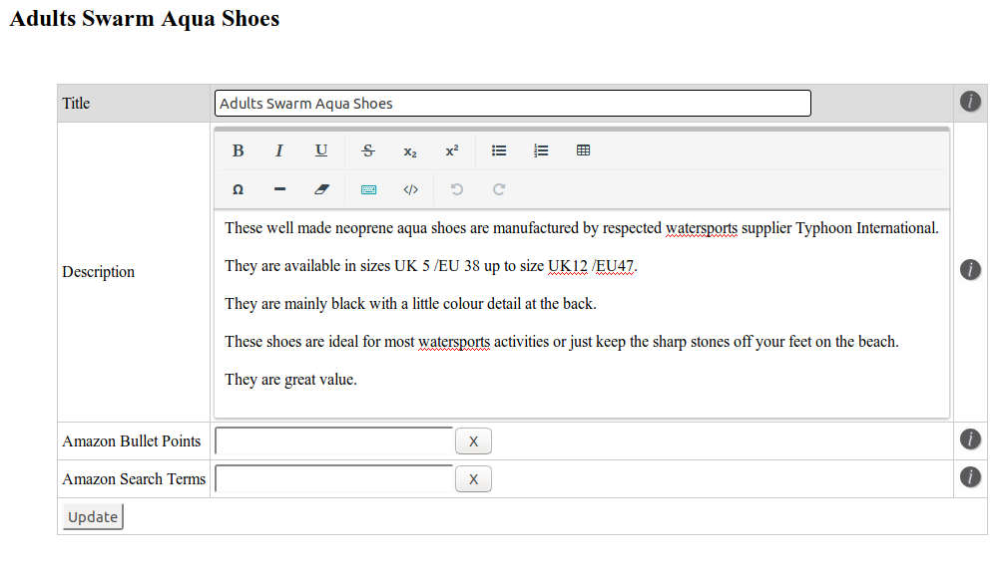

.. _inventory-location_page:

The Location Page
=================
From the Location Page you can change the :ref:`department
<glossary-product_range_details-department>` of a :ref:`Product Range
<glossary-product_range>` as well as the :ref:`Location <glossary-locations>` of
each of it's :ref:`Products <glossary-product>`.

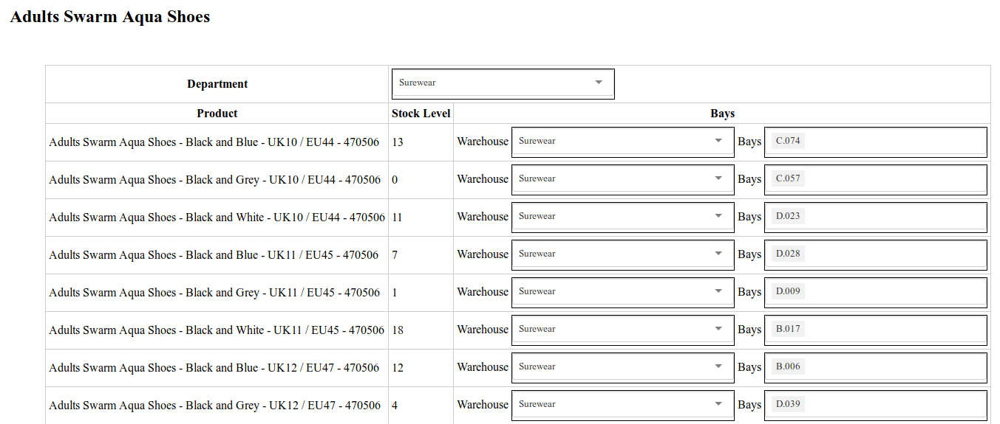

To change the **Department** use the department drop down box. To change a
**Product**'s location select the appropriate :ref:`Warehouse
<glossary-locations-warehouse>` from the warehouse drop down, then select the
required :ref:`Bays <glossary-locations-bay>` in the bays box. Every bay
associated with a particular **Product** must belong to the same **Warehouse**.
If the **Product** as backup at another location, use a :ref:`Backup Bay
<glossary-locations-backup_bay>`. Create new bays using the :ref:`Create Bays
Page <inventory-create_bay>`.

.. note::
    The loading time for this page depends on the number of **Products** in the
    **Range**. **Ranges** with a lot of variations may take some time to load.

.. _inventory-images_page:

The Images Page
===============
The **Images Page** allows you to view, upload and re-order **Product Images**
in **Cloud Commerce** and store images in STC Admin.

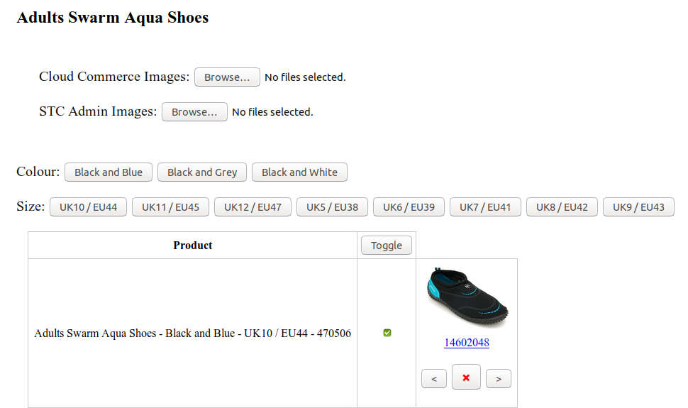

.. note::
    The loading time for this page depends on the number of :ref:`Products
    <glossary-product>` in the :ref:`Product Range <glossary-product_range>`.
    **Ranges** with a lot of variations may take some time to load.

.. _inventory-images_page-cloud_commerce_images:

Cloud Commerce Images
_____________________
Cloud Commerce Images are the **Product Images** saved in Cloud Commerce. Cloud
Commerce adds them to it's listings. You will see a table containing each
variation for the selected **Product Range**. To add an image to a particular
variation select the checkbox in the appropriate row of the table, then click
the **Browse** button next to *Cloud Commerce Images* above. This will create an
open file dialogue box allowing you to select one or more images. To add an
image to multiple variations, select multiple checkboxes in the image table. You
can select **Products** by :ref:`Variation Option
<glossary-product_options-variation_options>` using the buttons that appear
above the table.

When a variation has a **Product Image** associated with it will appear to the
right of it in the table. Beneath the image will be it's **Image ID**, this
doubles as a link to the original image file. By clicking on this you can view
the image full size and download it by right clicking on it and selecting
"**Save Image As...**". Underneath this are buttons to re-order the image left
or right and a red cross button to delete it.

.. _inventory-images_page-stcadmin_images:

STC Admin Images
________________
STC Admin Images are not uploaded to Cloud Commerce and are **not** added to
listings. This is for images that contain multiple variations and therefore do
not apply to any particular variation. Add them by clicking the **Browse**
button next to *STC Admin Images*. When a **Product Range** has STC Admin images
they will appear under the **Product Image Table**. Click on the image to view
it. To delete an image click the red cross next to it.

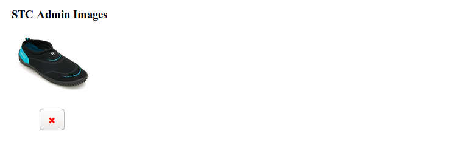

.. _inventory-price_calculator:

The Price Calculator
====================
The **Price Calculator** provides a guide line price at which to sell products
online. It uses product information to calculate the profit from a sale in a
given country at a given price. To calculate the profit for an existing
:ref:`Product <glossary-product>` go to it's :ref:`Range Page
<inventory-range_page>` and click on the "*Price Calculator*" button. You can
then select the country and input the sale price to see the sale profit.

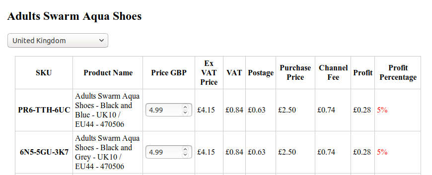

To calculate the price for a product not yet in the inventory select "*Price
Calculator*" from the inventory navigation bar. This will give you a price
calculator for which you can enter any product details. This can be useful for
products that are not yet in the inventory.

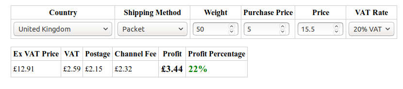

.. _inventory-barcode_labels:

The Barcode Labels Page
=======================
The **Barcode Labels** page allows you to print barcode labels for a
:ref:`Product Range <glossary-product_range>`. To do this you must select the
number of labels required for each :ref:`Product <glossary-product>` in the
**Range**. To set the same quantity of barcodes for multiple **Products** use
the check boxes to select them, enter the required quantity in the input above
the table and click on the *Update Selected* button. If you do not require any
barcodes for a particular **Product** set the quantity to zero. To produce the
barcodes click "*Product Barcodes*". This will generate a printable *.pdf* file
of barcode labels.

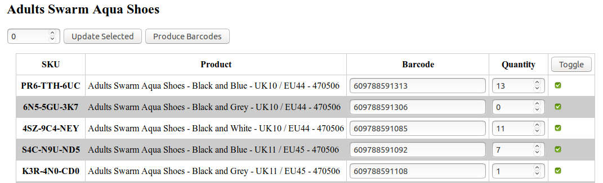

.. _inventory-create_bay:

The Create Bay Page
===================
Use the **Create Product Bay** page to create new :ref:`Bays
<glossary-locations-bay>`. To do this, select the :ref:`Department
<glossary-product_range_details-department>` from the department drop down, then
enter the name of the bay into the name field.

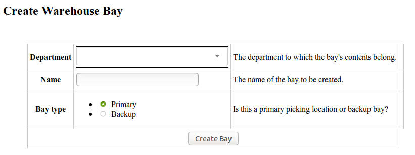

To create a :ref:`Backup Bay <glossary-locations-backup_bay>` select "Backup" as
the Bay type. A location drop down will appear, select the :ref:`Warehouse
<glossary-locations-warehouse>` physical location of the bay from this.

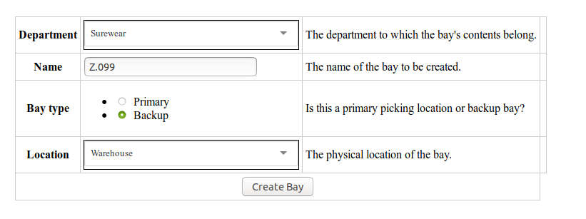

.. _inventory-create_supplier:

The Create Supplier Page
========================
Use the **Create Supplier Page** to add new :ref:`Suppliers
<glossary-product_details-supplier>` to Cloud Commerce. Enter the name of the
supplier in the name field and click *Create Supplier*.

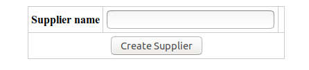

.. _inventory-generate_sku:

The Generate SKU Page
=====================
Use the **Generate SKU Page** to acquire new :ref:`Product SKUs
<glossary-product_details-sku>` and :ref:`Range SKUs
<glossary-product_range_details-range_sku>` Click the appropriate button and a
new **SKU** will appear in the text box next to it. You can then copy and paste
this wherever required. You can do this as multiple times.

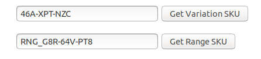

.. _inventory-common_tasks:

Common Tasks
============

.. _inventory-common_tasks-updating_stock_levels:

Updating Stock Levels
_____________________
The easiest way to update a :ref:`Product <glossary-product>`'s :ref:`Stock
Level <glossary-product_details-stock_level>` is to use the :ref:`Product Search
Page <inventory-product_search>` to find the necessary :ref:`Product Range
<glossary-product_range>`. From the search results click the **[[Show]]** button
next the **Product Range** to show it's variations.

.. image:: _images/inventory_help/product_search_results_expanded.jpg

You will see the current **Stock Level** of the **Product** next to its
:ref:`Title <glossary-product_details-title>` and :ref:`SKU
<glossary-product_details-sku>`. Change this number and click the "*Update Stock
Level*" button next to it to update the **Stock Level**. A tick will appear next
to the button unless an error occurs, in which case a cross will appear instead.
You can also update the **Stock Level** of the **Products** in a **Range** in a
similar manner from the :ref:`Range Page <inventory-range_page>` or a single
**Product** on the :ref:`Product Page <inventory-product_page>`.

.. _inventory-common_tasks-updating_product_locations:

Updating a Product's Locations
______________________________
To update the :ref:`Location <glossary-locations>` of a :ref:`Product
<glossary-product>` use the :ref:`Product Search <inventory-product_search>` to
find the necessary :ref:`Product Range <glossary-product_range>`, then access
the :ref:`Location Page <inventory-location_page>` by clicking on the "*L*"
button or clicking on the **Product**'s title to access the :ref:`Range Page
<inventory-range_page>` and clicking on the "*Locations*" button.

From here you can select a :ref:`Warehouse <glossary-locations-warehouse>` and
list the appropriate :ref:`Bays <glossary-locations-bay>` for each **Product**.
When the necessary changes are complete, click the "*Update Locations*" button.

If only one **Product** needs updating this you can do this from the
:ref:`Product Page <inventory-product_page>`. This page will load much faster
than the :ref:`Location Page <inventory-location_page>` if the **Range**
contains many **Products**.

