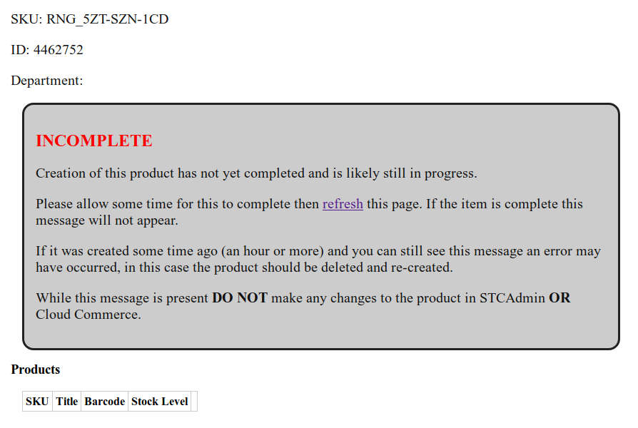
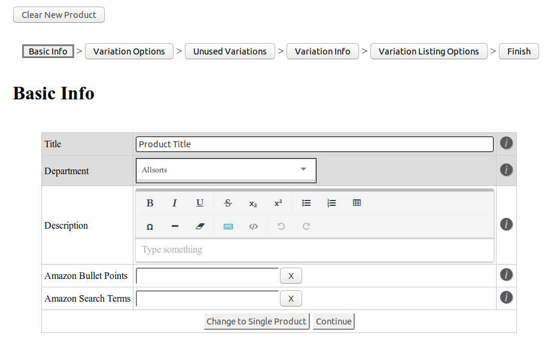
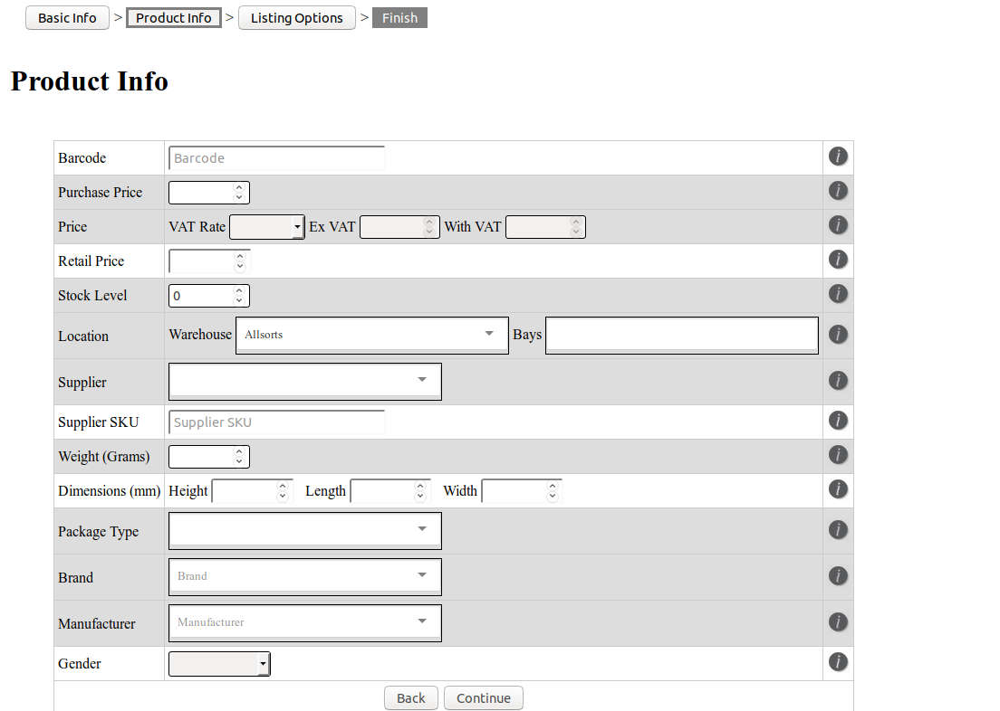
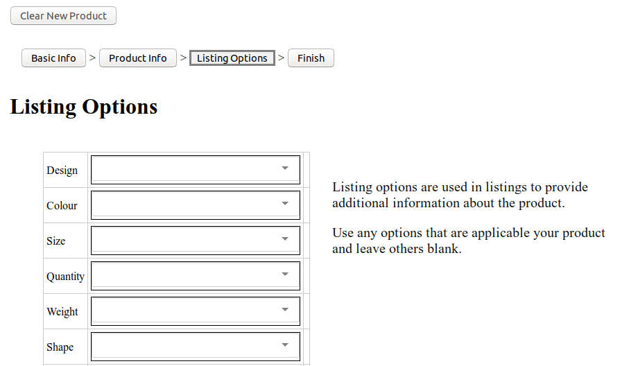
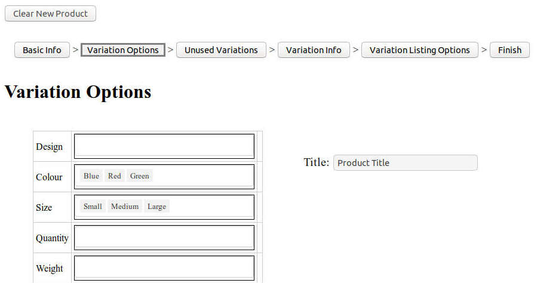
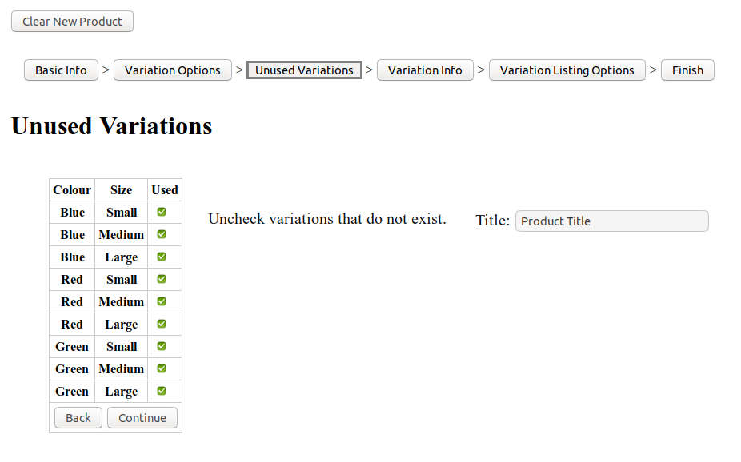
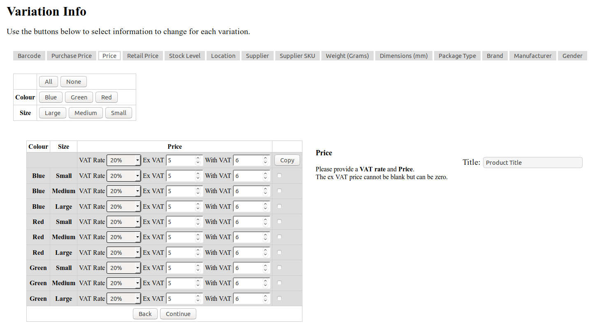
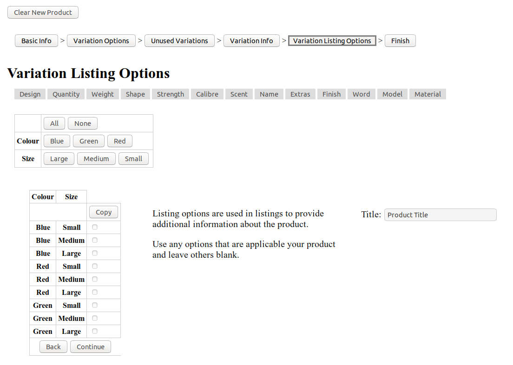

.. _product_editor:

******************
The Product Editor
******************

The Product Editor consists of a number of pages containing forms in which you
enter or change the details of new or existing :ref:`Product Ranges
<glossary-product_range>` and add :ref:`Products <glossary-product>` to a
**Range**. The top of each of these pages will show a list of pages required to
complete the product and allow you to jump to other pages. Some pages may not
appear or may not allow you to jump to them depending on the type of product you
are creating and how far through the process you have gotten.

.. contents:: Table of Contents

.. _product_editor-creating_products:

Creating Products on STC Admin
==============================
To begin creating a :ref:`Product Range <glossary-product_range>` navigate to
`STC Admin`_ and go to the `Inventory`_ section and select *New Product*.

.. _STC Admin: http://stcadmin.stcstores.co.uk
.. _Inventory: http://stcadmin.stcstores.co.uk/inventory/

If you have already created a product you will see forms are still filled with
the details of that product. This is so that a product can be re-created if an
error occurs during product creation. To start a new product click the *Clear
New Product* button at the top of the page. This will clear the current product
and take you to the first page of the product creation process, the :ref:`Basic
Info <product_editor-pages-basic_info>` page. This page allows you to enter
basic detail of the product range as well as information relevant to listings
that needs to be identical for every product in the range.

After completing this page click the continue button under the form. This will
take you to the :ref:`Product Info <product_editor-pages-product_info>` page. On
this page you will enter all the details of the product, or one of them if you
are creating a variation product range. At the bottom of the form you will see
buttons to *Create Single Product* or *Create Variation Product*. Select *Create
Single Product*, if your new Product Range contains a single Product, or the
*Create Variation Product* button, if it contains more than one Product.

.. _product_editor-creating_products-single_products:

Creating Single Products
________________________
Selecting *Create Single Product* you will take you to the :ref:`Listing Options
<product_editor-pages-listing_options>` page. This page allows you to set
*Product Options* for your product to add information about it that will appear
in the listings. Clicking continue will create the product.

.. _product_editor-creating_products-variation_products:

Creating Variation Products
___________________________
Selecting *Create Variation Product* will take you to the :ref:`Variation
Options <product_editor-pages-variation_options>` page. On this page you will
set the :ref:`Product Options <glossary-product_options-listing_options>` used
to differentiate the your variations. The used **Product Options** will appear
in the listing as the drop-down boxes used to select a variation. List the
existent values for each required **Product Option** and click continue.

The next page is the :ref:`Unused Variations
<product_editor-pages-unused_variations>` page. This page will list every
possible combination of the variations you set up on the previous page. If any
combination is not required deselect the checkbox next to it. It will now not
appear on any subsequent pages or in the inventory.

The next page is the :ref:`Variation Info <product_editor-pages-variation_info>`
page. This page will allow you to set the details of the variations. You can
select a field to update from the list at the top of the page. This will show
you a list of all the product's variations and their current values for the
field. Unless changed each variation will have the value set for that field on
the :ref:`Product Info <product_editor-pages-product_info>` page. Change the
value for any variation for which it is not correct.

The final page is the :ref:`Variation Listing Options
<product_editor-pages-variation_listing_options>` page. This page allows you to
set **Product Options** for your product to add information that will appear in
the listing. Select and update **Product Options** in the same way as the fields
on the :ref:`Variation Info <product_editor-pages-variation_info>` page where
appropriate.

.. _product_editor-editing_products:

Editing Products
================
To edit a :ref:`Product Range <glossary-product_range>` in the **Product
Editor** go to its :ref:`Range Page <inventory-range_page>` and click on the
*edit* button. The editing process works in the same way as :ref:`creating new
*products <product_editor-creating_products>`. If you are editing a single
product you can update the :ref:`product details <glossary-product_details>` on
the :ref:`Product Info <product_editor-pages-product_info>` page, for
:ref:`variation <glossary-variation>` **Ranges** you will use the
:ref:`Variation Info <product_editor-pages-variation_info>` page. You can use
the :ref:`Basic Info <product_editor-pages-basic_info>` page to edit :ref:`range
details <glossary-product_range_details>`. You can use the :ref:`Variation
Options <product_editor-pages-variation_options>` page to add new variations but
*not* to remove existing variations or to change the selected :ref:`Variation
Options <glossary-product_options-variation_options>`. You can use the
:ref:`Unused Variations <product_editor-pages-unused_variations>` page to
deselect new variations but *not* to remove existing **Products**.

.. _product_editor-finishing_products:

Finishing Products
==================
When you click continue on the :ref:`Listing Options
<product_editor-pages-listing_options>` or :ref:`Variation Listing Options
<product_editor-pages-variation_listing_options>` STC Admin will update Cloud
Commerce with your new **Product Range** or with the changes to the existing
**Range**. You will land on it's :ref:`Range Page <inventory-range_page>`,
however the update will not yet be complete. In this case a message will appear
stating it. Please wait for the update to complete. **Ranges** with more
variations will take longer to create.

Once the update is complete the inventory page will appear as usual, without the
"Incomplete Product" message. If any error occurs during product creation you
will be able to retry the process or change the details of the product.

.. _product_editor-pages:

Pages
=====
This is a list of pages used in the **Product Editor**.

.. _product_editor-pages-basic_info:

Basic Info
__________
Use the **Basic Info** page to input information about the :ref:`Range Details
<glossary-product_range_details>` of a :ref:`Product Range
<glossary-product_range>`. This is the first page you will see when creating a
new **Range** in the **Product Editor**.

Fields:

* :ref:`Title <product_editor-fields-title>`
* :ref:`Department <product_editor-fields-department>`
* :ref:`Description <product_editor-fields-description>`
* :ref:`Amazon Bullet Points <product_editor-fields-amazon_bullet_points>`
* :ref:`Amazon Search Terms <product_editor-fields-amazon_search_terms>`

.. _product_editor-pages-product_info:

Product Info
____________
Use the **Product Info** page to input :ref:`Product Details
<glossary-product_details>`. When creating or editing a single product this is
where you will input the bulk of the product information. When creating
variations this page will set default values for the Variation Info page where
you can alter it for each variation. This page is not used when editing
:ref:`Variation Ranges <glossary-product_range-variation_product>`.

Fields:

* :ref:`Barcode <product_editor-fields-barcode>`
* :ref:`Purchase Price <product_editor-fields-purchase_price>`
* :ref:`Price <product_editor-fields-price>`
* :ref:`Retail Price <product_editor-fields-retail_price>`
* :ref:`Stock Level <product_editor-fields-stock_level>`
* :ref:`Location <product_editor-fields-location>`
* :ref:`Supplier <product_editor-fields-supplier>`
* :ref:`Supplier SKU <product_editor-fields-supplier_sku>`
* :ref:`Weight <product_editor-fields-weight>`
* :ref:`Dimensions <product_editor-fields-dimensions>`
* :ref:`Package Type <product_editor-fields-package_type>`
* :ref:`Brand <product_editor-fields-brand>`
* :ref:`Manufacturer <product_editor-fields-manufacturer>`
* :ref:`Gender <product_editor-fields-gender>`

.. _product_editor-pages-listing_options:

Listing Options
_______________
Use the **Listing Options** page to provide :ref:`Listing Options
<glossary-product_options-listing_options>` to new or existing single
:ref:`Products <glossary-product>`. The :ref:`Variation Listing Options
<product_editor-pages-variation_listing_options>` page performs the same role
for variation listings. This page is not used for :ref:`Variation Products
<glossary-product_range-variation_product>`.

.. _product_editor-pages-variation_options:

Variation Options
_________________
Use the **Variation Options** page to set the :ref:`Variation Options
<glossary-product_options-variation_options>` for a :ref:`Variation Product
<glossary-product_range-variation_product>`. When creating a :ref:`Product Range
<glossary-product_range>` it will give you a choice of **Product Options** to
use as the way in which the product varies. List every value each applicable
**Product Option**. When editing a product it will display the **Variation
Options** already selected, with the values filled in. It is not possible to
change the selected **Variation Options** with the **Product Editor**. You can
use this page to add new values to the selected **Options** but not to delete
existing :ref:`Variations <glossary-variation>`. Removing the existing values
from the fields will have no effect. This page is not used when creating or
editing :ref:`Single Products <glossary-product_range-single_product>`.

.. _product_editor-pages-unused_variations:

Unused Variations
_________________
The Unused Variation page gives you a list of every possible combination of
variations as set on the :ref:`Variation Options
<product_editor-pages-variation_options>` page. If any combination is not
required for your product deselect the appropriate checkbox. Deselected
combinations will not appear as :ref:`Variations <glossary-variation>` in your
:ref:`Product Range <glossary-product_range>`. When editing :ref:`Variation
Products <glossary-product_range-variation_product>` you can use this page to
deselect new **Variations** but not to remove existing ones. This page is not
used when creating or editing :ref:`Single Products
<glossary-product_range-single_product>`.

.. _product_editor-pages-variation_info:

Variation Info
______________
Use the **Variation Info** page to input :ref:`Product Details
<glossary-product_details>` for :ref:`Variation Products
<glossary-product_range-variation_product>`. When creating a :ref:`Product Range
<glossary-product_range>`, until changed, each :ref:`Variation
<glossary-variation>` will copy the details set on the :ref:`Product Info
<product_editor-pages-product_info>` page. At the top of the page is the list of
**Product Details**, you can use this to select a **Detail** to edit. When you
select a **Detail** it will appear for each of the **Variations** listed below.
You can manually change the **Detail** for each **Variation** or update them in
bulk. To bulk update **Variations**, select them using the checkboxes next to
them or by toggling them by :ref:`Variation Option
<glossary-product_options-variation_options>` using the buttons above. You will
see an additional field for the **Detail** above the **Variations** with a
*Copy* button next to it. Input the required value in this field and click
*Copy*, this will replace the value of this **Detail** for every selected
**Variation**. This page is not used when creating or editing :ref:`Single
Products <glossary-product_range-single_product>`.

Fields:

* :ref:`Barcode <product_editor-fields-barcode>`
* :ref:`Purchase Price <product_editor-fields-purchase_price>`
* :ref:`Price <product_editor-fields-price>`
* :ref:`Retail Price <product_editor-fields-retail_price>`
* :ref:`Stock Level <product_editor-fields-stock_level>`
* :ref:`Location <product_editor-fields-location>`
* :ref:`Supplier <product_editor-fields-supplier>`
* :ref:`Supplier SKU <product_editor-fields-supplier_sku>`
* :ref:`Weight <product_editor-fields-weight>`
* :ref:`Dimensions <product_editor-fields-dimensions>`
* :ref:`Package Type <product_editor-fields-package_type>`
* :ref:`Brand <product_editor-fields-brand>`
* :ref:`Manufacturer <product_editor-fields-manufacturer>`
* :ref:`Gender <product_editor-fields-gender>`

.. _product_editor-pages-variation_listing_options:

Variation Listing Options
_________________________
The **Variation Listing Options** page works in the same way as the
:ref:`Variation Info <product_editor-pages-variation_listing_options>` page, but
performs the same purpose as the :ref:`Listing Options
<product_editor-pages-listing_options>` page for :ref:`Variation Products
<glossary-product_range-variation_product>`. It allows you to use :ref:`Listing
Options <glossary-product_options-listing_options>` to add details to your
product listings. Select fields and update variations in the same way as the
:ref:`Variation Info <product_editor-pages-variation_info>` page. This page is
not used when creating or editing :ref:`Single Products
<glossary-product_range-single_product>`.

.. _product_editor-pages-finish:

Finish
______
The **Finish** page will redirect you to the :ref:`Range Page
<inventory-range_page>` for your product and begin the process of creating or
updating it. Until every :ref:`Product <glossary-product>` is complete the page
will show an **INCOMPLETE** message.

When all changes are complete the message will disappear and the **Range Page**
will appear as normal. If an error occurs during product creation you will have
the option to try again or edit the product.

.. _product_editor-fields:

Fields
======
This is a list of the fields used to fill in :ref:`Range Details
<glossary-product_range_details>` and :ref:`Product Details
<glossary-product_details>` in the **Product Editor**.

.. _product_editor-fields-title:

Title
_____
The name of the **Product Range** to create. See :ref:`Product Range Title
<glossary-product_range_details-title>`, :ref:`Product Title
<glossary-product_details-title>`.

* The title must *not* contain key words. This includes colours, sizes etc.
* This title is for internal reference and is not necessarily used for listings.
  It is, however, used on our website.
* It must make sense grammatically and not include dashes.
* It must use proper **title case**. (The first letter of every word should be
  capital except for connective words such as "and" or "the" unless they are the
  first word of the title.)
* **Required**

.. _product_editor-fields-department:

Department
__________
The department to which the product belongs. See :ref:`Department
<glossary-product_range_details-department>`.

* **Required**

.. _product_editor-fields-description:

Description
___________
Full description used in listings. See :ref:`Description
<glossary-product_range_details-description>`

* This is **required** for any item listed online. You can leave it blank and
  add it later if necessary.
* Must **not** start with the title of the product.
* Must **not** include information about **price** or **postage**.
* Do **not** use abbreviations such as "L" for length as this is not
  translatable for foreign listings.
* Sentences must end with full stops.
* Make correct use of capitalisation.
* The description can **contain** bullet points to highlight key information
  but **MUST NOT** consist solely of bullet points.
* **Not Required**

.. _product_editor-fields-amazon_bullet_points:

Amazon Bullet Points
____________________
The bullet points that will appear at the top of the Amazon listing. See
:ref:`Amazon Bullet Points <glossary-product_range_details-amazon_bullet_points>`

* These are far more prominent than the main description.
* Each bullet point should be about one sentence long.
* Can repeat key information from the main description.
* All rules for :ref:`descriptions <product_editor-fields-description>` also
  apply to bullet points.
* **Not Required**

.. _product_editor-fields-amazon_search_terms:

Amazon Search Terms
___________________
Key words and phrases that people might use to find the product. See
:ref:`Amazon Bullet Points <glossary-product_range_details-amazon_search_terms>`

* A list of keywords and key phrases used by Amazon to match a listing to
  customer's searches.
* Can include alternate words and spelling.
* Search terms must go here, **not** in the product title.
* **Not Required**

.. _product_editor-fields-barcode:

Barcode
_______
The barcode used when listing the product. See :ref:`Barcode
<glossary-product_details-barcode>`.

* Must be unique within our inventory.
* Use the manufacturer provided barcode where possible.
* Do not use the manufacturer's barcode if multiple variations use the same one.
* Leave blank to use a barcode from our stock.
* When listing variations do **not** mix our barcodes with manufacturer
  barcodes. If manufacturer barcodes are not available for all variations use
  our own.
* **Not Required**

.. _product_editor-fields-purchase_price:

Purchase Price
______________
The price paid to purchase the product. See :ref:`Purchase Price
<glossary-product_details-purchase_price>`.

* This should always reflect the current price at which we can restock the
  item.
* If the supplier's prices change update the purchase price.
* **Required**

.. _product_editor-fields-price:

Price
_____
The price and VAT rate the product sells with online in the UK. See :ref:`Price
<glossary-product_details-price>` and :ref:`VAT Rate
<glossary-product_details-vat_rate>`.

* You cannot enter a price until you select a VAT rate.
* You can enter the price either with or without VAT using the appropriate
  field, the other will update accordingly.
* **Required**

.. _product_editor-fields-retail_price:

Retail Price
____________

The price at which the product sells in shops. See :ref:`Retail Price
<glossary-product_details-retail_price>`.

* **Not Required**

.. _product_editor-fields-stock_level:

Stock Level
___________
The initial stock level of the product. See :ref:`Stock Level
<glossary-product_details-stock_level>`.

* **Required**

.. _product_editor-fields-location:

Location
________
The picking location of the product. See :ref:`Locations <glossary-locations>`.

* Set the Warehouse field according to the pick list on which the product
  should appear.
* The warehouse field will default to the department selected on the Basic Info
  page.
* You can set multiple bays as required but they must all belong to the same
  warehouse.
* If you leave the product field blank it will set to the default bay for the
  selected warehouse.
* Add new bays using the Create Bay page.
* **Warehouse field required.**

.. _product_editor-fields-supplier:

Supplier
________
The supplier which sells the product. See :ref:`Supplier
<glossary-product_details-supplier>`.

* Select the supplier from the list.
* Create new suppliers on the Create Supplier page.
* **Required**

.. _product_editor-fields-supplier_sku:

Supplier SKU
____________
The supplier's SKU for the product. See :ref:`Suppler SKU
<glossary-product_details-supplier_sku>`.

* This is sometimes referred to as a **Product Code**.
* **Not Required**

.. _product_editor-fields-weight:

Weight
______
The weight of the product in **grams**. See :ref:`Weight
<glossary-product_details-weight>`.

* Enter the correct weight to the nearest gram.
* Accuracy is important as our couriers charge based on this number.
* If the item requires extra packaging such as cardboard estimate how much
  weight this will add and add that to the weight.
* **Required**

.. _product_editor-fields-dimensions:

Dimensions
__________
Dimensions of the product in millimetres. See :ref:`Dimensions
<glossary-product_details-dimensions>`.

* Enter the largest dimension in Length.
* Enter the second largest dimension in Width.
* Enter the smallest dimension in Height.
* Used to select the appropriate shipping service and will not appear in the
  listing.
* **Not Required.**

.. _product_editor-fields-package_type:

Package Type
____________
The type of package used to send the product. See :ref:`Package Types
<glossary-product_details-package_type>`.

* Used to select the appropriate shipping service for the product both in the UK
  and internationally.
* Based on size and weight of the item when packed.
* This will be greater for items requiring additional packaging such as
  cardboard.
* If in doubt contact the packing department.
* **Required**

.. _product_editor-fields-brand:

Brand
_____
The brand of the product. See :ref:`Brand <glossary-product_details-brand>`.

* If there is no available brand for the product a placeholder such as
  "Unbranded" is acceptable.
* **Required**

.. _product_editor-fields-manufacturer:

Manufacturer
____________
The manufacturer of the product. See :ref:`Manufacturer
<glossary-product_details-manufacturer>`.

* If the manufacturer is unknown use the name of the supplier.
* **Required**

.. _product_editor-fields-gender:

Gender
______
The target gender of the product. See :ref:`Gender
<glossary-product_details-gender>`.

* Required for listing clothing items on Amazon. Leave blank for other products.
